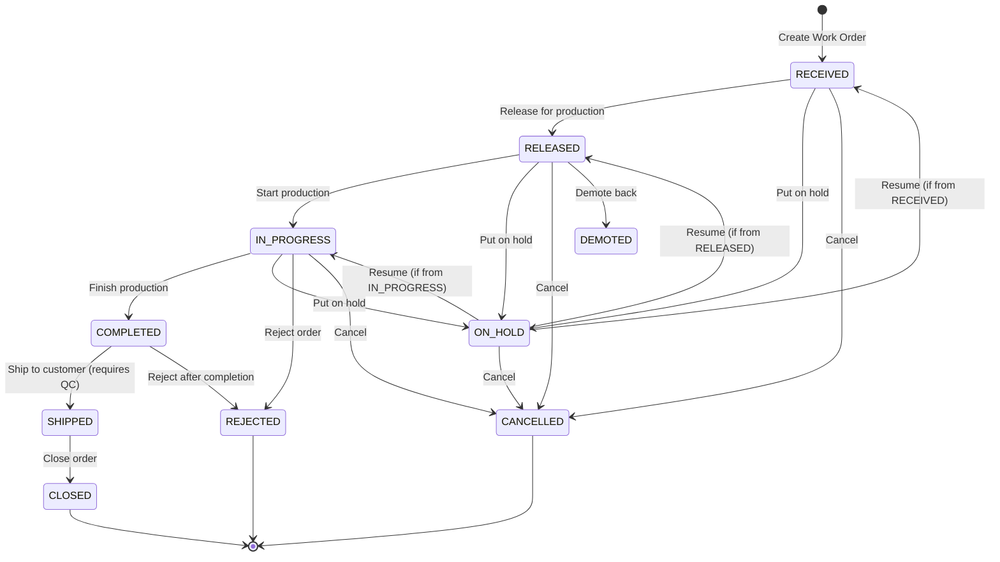

# Workflow State Machine Documentation

## Overview

The KPI Operations platform uses a flexible state machine for work order lifecycle management. The workflow supports:
- Client-specific configuration
- Pre-defined workflow templates
- QC approval gates
- Hold/resume functionality
- Audit trail logging

---

## State Diagram



---

## Status Definitions

| Status | Description | Entry Condition | Exit Condition |
|--------|-------------|-----------------|----------------|
| **RECEIVED** | Work order received from customer | Creation | Release to production |
| **RELEASED** | Released to production floor | From RECEIVED | Production starts |
| **IN_PROGRESS** | Active production | Work started | Quantity completed |
| **COMPLETED** | Production complete | `actual_quantity > 0` | QC approved & shipped |
| **SHIPPED** | Shipped to customer | `qc_approved = 1` | Client confirms receipt |
| **CLOSED** | Order lifecycle complete | Shipped or completed | N/A (terminal) |
| **ON_HOLD** | Temporarily paused | Hold request | Resume to previous status |
| **DEMOTED** | Returned to pre-release | From RELEASED | Re-release |
| **CANCELLED** | Order cancelled | Cancellation request | N/A (terminal) |
| **REJECTED** | QC/customer rejection | Rejection | N/A (terminal) |

---

## Transition Rules

### Default Transitions

```python
DEFAULT_WORKFLOW_TRANSITIONS = {
    "RELEASED": ["RECEIVED"],           # Can release from RECEIVED
    "IN_PROGRESS": ["RELEASED"],        # Can start from RELEASED
    "COMPLETED": ["IN_PROGRESS"],       # Can complete from IN_PROGRESS
    "SHIPPED": ["COMPLETED"],           # Can ship from COMPLETED
    "CLOSED": ["SHIPPED", "COMPLETED"], # Can close from SHIPPED or COMPLETED
    "ON_HOLD": ["RECEIVED", "RELEASED", "IN_PROGRESS"],  # Hold from active states
    "DEMOTED": ["RELEASED"],            # Demote from RELEASED
    "CANCELLED": ["RECEIVED", "RELEASED", "IN_PROGRESS", "ON_HOLD", "DEMOTED"],
    "REJECTED": ["IN_PROGRESS", "COMPLETED"]
}
```

### Universal Transitions

These transitions are allowed from any active state:
- `ON_HOLD` - Can hold from any non-terminal state
- `CANCELLED` - Can cancel from any non-terminal state

### Terminal States

No transitions allowed from:
- `CLOSED`
- `CANCELLED`
- `REJECTED`

---

## QC Approval Gate

### Requirement

**SHIPPED status requires `qc_approved = 1`**

### Workflow

```
1. Work order reaches COMPLETED status
2. QC inspection performed
3. POST /api/work-orders/{id}/approve-qc
4. Work order can now transition to SHIPPED
```

### API Endpoint

```http
POST /api/work-orders/{work_order_id}/approve-qc
Content-Type: application/json

{
    "notes": "QC inspection passed. No defects found."
}
```

### Response

```json
{
    "status": "approved",
    "work_order_id": "WO-12345",
    "qc_approved": true,
    "qc_approved_date": "2024-01-15T14:30:00Z",
    "qc_approved_by": "user123",
    "message": "Work order WO-12345 QC approved. Can now transition to SHIPPED."
}
```

### Audit Trail

QC approval creates a `WorkflowTransitionLog` entry:
- `from_status`: Current status
- `to_status`: Current status (not a status transition)
- `trigger_source`: "qc_approval"
- `notes`: QC approval notes

---

## Hold/Resume Functionality

### Putting on Hold

When a work order is placed on hold:
1. Current status saved to `previous_status`
2. Status changed to `ON_HOLD`
3. `HoldEntry` record created
4. `WorkflowTransitionLog` entry created

### Resuming from Hold

When resuming:
1. Status returns to `previous_status`
2. `HoldEntry.hold_end_date` set
3. `WorkflowTransitionLog` entry created

### Hold Duration in WIP Aging

Hold durations are **excluded** from WIP aging calculations:
```
WIP Aging = (current_date - received_date) - total_hold_duration
```

---

## Client-Specific Configuration

### Workflow Templates

Pre-defined templates available:

| Template ID | Description |
|-------------|-------------|
| `standard` | Full 6-status workflow |
| `express` | Simplified 4-status workflow |
| `with_qc` | Standard + mandatory QC gate |
| `minimal` | Receive → Complete → Close |

### Applying a Template

```python
from backend.services.workflow_service import apply_workflow_template

result = apply_workflow_template(db, client_id="CLIENT-123", template_id="standard")
```

### Custom Configuration

Clients can customize via `CLIENT_CONFIG` table:
- `workflow_statuses`: JSON array of enabled statuses
- `workflow_transitions`: JSON object of transition rules
- `workflow_optional_statuses`: Statuses that can be skipped
- `workflow_closure_trigger`: When to auto-close

### Closure Triggers

| Trigger | Description |
|---------|-------------|
| `at_shipment` | Auto-close when SHIPPED |
| `at_completion` | Auto-close when COMPLETED |
| `at_client_receipt` | Close on client confirmation |
| `manual` | Explicit close required |

---

## Transition Validation

### Validation Steps

1. **Terminal state check**: Cannot transition from terminal states
2. **Transition rule check**: Is this transition allowed?
3. **Business rule check**: Are conditions met?

### Business Rule Validations

| Transition | Validation |
|------------|------------|
| → COMPLETED | `actual_quantity > 0` |
| → SHIPPED | `qc_approved = 1` |
| Resume from ON_HOLD | Must return to `previous_status` |

### Validation Response

```json
{
    "is_valid": false,
    "reason": "Cannot mark as SHIPPED: QC approval required",
    "allowed_transitions": ["ON_HOLD", "CANCELLED"]
}
```

---

## Audit Trail

### WorkflowTransitionLog Table

Every status change creates a log entry:

| Field | Description |
|-------|-------------|
| `work_order_id` | Work order ID |
| `client_id` | Client ID |
| `from_status` | Previous status |
| `to_status` | New status |
| `transitioned_by` | User ID |
| `transitioned_at` | Timestamp |
| `notes` | Transition notes |
| `trigger_source` | manual, bulk, qc_approval, system |
| `elapsed_from_received_hours` | Hours since received |
| `elapsed_from_previous_hours` | Hours since last transition |

### Retrieving History

```http
GET /api/work-orders/{work_order_id}/timeline
```

Returns chronological list of all events including:
- Status transitions
- Hold/resume events
- QC approvals
- Creation/completion/delivery dates

---

## API Reference

### Get Allowed Transitions

```http
GET /api/work-orders/{work_order_id}/allowed-transitions
```

### Execute Transition

```http
PATCH /api/work-orders/{work_order_id}/status
Content-Type: application/json

{
    "status": "IN_PROGRESS",
    "notes": "Starting production"
}
```

### Bulk Transition

```http
POST /api/work-orders/bulk-transition
Content-Type: application/json

{
    "work_order_ids": ["WO-001", "WO-002", "WO-003"],
    "to_status": "RELEASED",
    "notes": "Bulk release for morning shift"
}
```

---

## Error Handling

### Common Errors

| Error | Status | Message |
|-------|--------|---------|
| Invalid transition | 400 | "Transition from {from} to {to} is not allowed" |
| Terminal state | 400 | "Cannot transition from terminal status {status}" |
| QC not approved | 400 | "Cannot mark as SHIPPED: QC approval required" |
| Missing quantity | 400 | "Cannot mark as COMPLETED: actual_quantity must be > 0" |
| Not found | 404 | "Work order not found" |
| Access denied | 403 | "Access denied to this client's data" |
