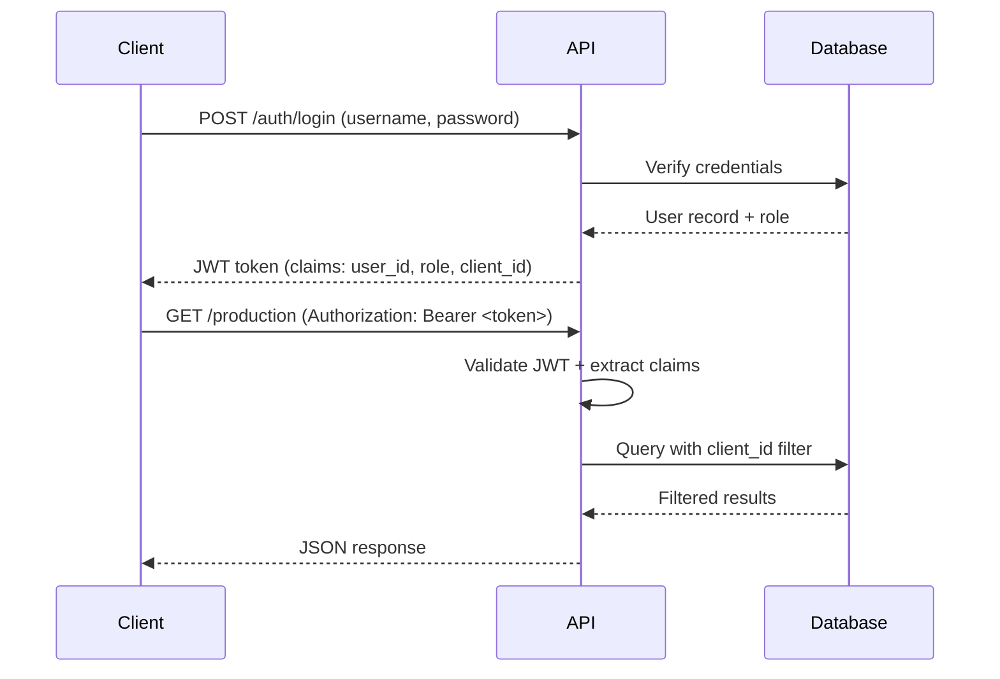

# Manufacturing KPI Platform - API Design Specification

**Version:** 1.0
**Date:** 2025-12-31
**Author:** System Architect
**Status:** Phase 1 MVP Ready

---

## Table of Contents

1. [Overview](#overview)
2. [API Architecture](#api-architecture)
3. [Authentication & Authorization](#authentication--authorization)
4. [Core API Endpoints](#core-api-endpoints)
5. [Request/Response Schemas](#requestresponse-schemas)
6. [Error Handling](#error-handling)
7. [Rate Limiting & Performance](#rate-limiting--performance)
8. [Inference Engine API](#inference-engine-api)

---

## Overview

### Technology Stack
- **Framework:** FastAPI 0.104+
- **Authentication:** JWT (JSON Web Tokens)
- **Validation:** Pydantic v2
- **Database:** SQLAlchemy 2.0 + MariaDB
- **Documentation:** OpenAPI 3.0 (auto-generated by FastAPI)

### Design Principles
1. **RESTful Design:** Resource-based URLs, standard HTTP methods
2. **Client Isolation:** All endpoints filter by `client_id` based on JWT claims
3. **Validation First:** Pydantic schemas validate all inputs/outputs
4. **Inference-Ready:** Missing data handled gracefully with fallback logic
5. **Audit Trail:** Every write operation logs user_id and timestamp

### Base URL
```
Production: https://api.manufacturing-kpi.com/api/v1
Development: http://localhost:8000/api/v1
```

---

## API Architecture

### Project Structure
```
app/
├── main.py                      # FastAPI application entry
├── config/
│   ├── settings.py             # Environment configuration
│   └── database.py             # Database connection pool
├── models/                      # Pydantic validation models
│   ├── production.py           # ProductionEntryCreate, ProductionEntryResponse
│   ├── work_order.py           # WorkOrderCreate, WorkOrderResponse
│   ├── user.py                 # UserLogin, UserResponse
│   └── kpi.py                  # KPIResponse, KPICalculation
├── schemas/                     # SQLAlchemy ORM models
│   ├── production_entry.py
│   ├── work_order.py
│   └── user.py
├── crud/                        # Database CRUD operations
│   ├── production.py
│   ├── work_order.py
│   └── user.py
├── calculations/                # KPI calculation logic
│   ├── efficiency.py           # KPI #3: Efficiency
│   ├── performance.py          # KPI #9: Performance
│   ├── inference.py            # Missing data inference engine
│   └── utils.py                # Shared calculation utilities
├── reports/                     # Report generation
│   ├── pdf_generator.py
│   ├── excel_generator.py
│   └── email_sender.py
├── auth/                        # Authentication & authorization
│   ├── jwt_handler.py
│   ├── rbac.py                 # Role-based access control
│   └── dependencies.py         # FastAPI dependencies
└── routers/                     # API route handlers
    ├── auth.py                 # /auth endpoints
    ├── production.py           # /production endpoints
    ├── kpi.py                  # /kpi endpoints
    ├── reports.py              # /reports endpoints
    └── admin.py                # /admin endpoints
```

---

## Authentication & Authorization

### JWT Token Flow



### Authentication Endpoints

#### `POST /api/v1/auth/login`
**Description:** User login - returns JWT token
**Request:**
```json
{
  "username": "operator1",
  "password": "secure_password_hash"
}
```

**Response (200 OK):**
```json
{
  "access_token": "eyJhbGciOiJIUzI1NiIsInR5cCI6IkpXVCJ9...",
  "token_type": "bearer",
  "expires_in": 3600,
  "user": {
    "user_id": "USR-002",
    "username": "operator1",
    "full_name": "John Doe",
    "role": "OPERATOR_DATAENTRY",
    "client_id": "BOOT-LINE-A"
  }
}
```

**JWT Token Claims:**
```json
{
  "sub": "USR-002",
  "username": "operator1",
  "role": "OPERATOR_DATAENTRY",
  "client_id": "BOOT-LINE-A",
  "exp": 1735660800,
  "iat": 1735657200
}
```

#### `POST /api/v1/auth/refresh`
**Description:** Refresh expired token
**Request:**
```json
{
  "refresh_token": "eyJhbGciOiJIUzI1NiIsInR5cCI6IkpXVCJ9..."
}
```

**Response (200 OK):**
```json
{
  "access_token": "new_jwt_token...",
  "token_type": "bearer",
  "expires_in": 3600
}
```

### Role-Based Access Control (RBAC)

| Role | Permissions |
|------|-------------|
| **OPERATOR_DATAENTRY** | Read own client data, Create production entries, View KPIs |
| **LEADER_DATACONFIG** | All OPERATOR permissions + Edit entries, Configure targets, Verify data |
| **POWERUSER** | All LEADER permissions + Multi-client access, Export reports, View analytics |
| **ADMIN** | All permissions + User management, System configuration, Database access |

---

## Core API Endpoints

### Production Entry Endpoints

#### `POST /api/v1/production/entry`
**Description:** Create single production entry (manual entry)
**Authorization:** OPERATOR_DATAENTRY or higher
**Request:**
```json
{
  "work_order_id": "2025-12-15-BOOT-ABC123",
  "job_id": "2025-12-15-BOOT-ABC123-L1",
  "shift_date": "2025-12-15",
  "shift_type": "SHIFT_1ST",
  "operation_id": "SEWING",
  "units_produced": 100,
  "units_defective": 2,
  "run_time_hours": 8.5,
  "employees_assigned": 10,
  "employees_present": 9,
  "notes": "Material shortage delayed start by 30 min"
}
```

**Validation Rules:**
- `work_order_id` must exist in database
- `shift_date` cannot be future date
- `units_defective` ≤ `units_produced`
- `run_time_hours` ≤ 24
- `employees_assigned` > 0

**Response (201 Created):**
```json
{
  "production_entry_id": "PROD-20251215-143045-001",
  "work_order_id": "2025-12-15-BOOT-ABC123",
  "shift_date": "2025-12-15",
  "units_produced": 100,
  "calculated_metrics": {
    "efficiency": 29.41,
    "performance": 113.6,
    "defect_rate": 2.0
  },
  "inference_flags": [],
  "created_at": "2025-12-15T14:30:45Z",
  "created_by": "USR-002"
}
```

#### `POST /api/v1/production/batch`
**Description:** Upload CSV batch (100+ records)
**Authorization:** OPERATOR_DATAENTRY or higher
**Request:** `multipart/form-data`
```
Content-Type: multipart/form-data
--boundary
Content-Disposition: form-data; name="file"; filename="production_batch.csv"
Content-Type: text/csv

work_order_id,shift_date,shift_type,units_produced,...
2025-12-15-BOOT-ABC123,2025-12-15,SHIFT_1ST,100,...
```

**Response (202 Accepted):**
```json
{
  "batch_id": "BATCH-20251215-143500",
  "total_rows": 247,
  "valid_rows": 235,
  "invalid_rows": 12,
  "errors": [
    {
      "row": 45,
      "field": "shift_date",
      "error": "Invalid date format. Expected YYYY-MM-DD, got '12/15/2025'"
    },
    {
      "row": 89,
      "field": "units_produced",
      "error": "Negative value not allowed: -5"
    }
  ],
  "status_url": "/api/v1/production/batch/BATCH-20251215-143500/status"
}
```

#### `GET /api/v1/production/batch/{batch_id}/status`
**Description:** Check CSV upload processing status
**Response (200 OK):**
```json
{
  "batch_id": "BATCH-20251215-143500",
  "status": "PROCESSING",
  "progress": {
    "total": 235,
    "processed": 150,
    "failed": 0
  },
  "estimated_completion": "2025-12-15T14:40:00Z"
}
```

#### `GET /api/v1/production/entries`
**Description:** List production entries with filters
**Authorization:** OPERATOR_DATAENTRY or higher
**Query Parameters:**
- `client_id` (optional if ADMIN/POWERUSER, required for OPERATOR)
- `date_from` (YYYY-MM-DD)
- `date_to` (YYYY-MM-DD)
- `shift_type` (SHIFT_1ST, SHIFT_2ND, SAT_OT, SUN_OT, OTHER)
- `work_order_id` (optional)
- `page` (default: 1)
- `limit` (default: 50, max: 500)

**Example Request:**
```
GET /api/v1/production/entries?date_from=2025-12-01&date_to=2025-12-31&shift_type=SHIFT_1ST&page=1&limit=50
Authorization: Bearer <jwt_token>
```

**Response (200 OK):**
```json
{
  "total": 247,
  "page": 1,
  "limit": 50,
  "results": [
    {
      "production_entry_id": "PROD-20251215-143045-001",
      "work_order_id": "2025-12-15-BOOT-ABC123",
      "shift_date": "2025-12-15",
      "shift_type": "SHIFT_1ST",
      "units_produced": 100,
      "units_defective": 2,
      "efficiency": 29.41,
      "performance": 113.6,
      "created_by": "operator1",
      "verified": false
    }
  ]
}
```

#### `PUT /api/v1/production/entry/{entry_id}`
**Description:** Update production entry (LEADER or higher)
**Request:**
```json
{
  "units_produced": 105,
  "notes": "Corrected count after recount"
}
```

**Response (200 OK):**
```json
{
  "production_entry_id": "PROD-20251215-143045-001",
  "updated_fields": ["units_produced", "notes"],
  "updated_at": "2025-12-15T15:30:00Z",
  "updated_by": "USR-003"
}
```

#### `POST /api/v1/production/entry/{entry_id}/verify`
**Description:** Mark entry as verified by supervisor
**Authorization:** LEADER_DATACONFIG or higher
**Response (200 OK):**
```json
{
  "production_entry_id": "PROD-20251215-143045-001",
  "verified_by": "USR-003",
  "verified_at": "2025-12-15T16:00:00Z",
  "status": "VERIFIED"
}
```

---

### KPI Calculation Endpoints

#### `GET /api/v1/kpi/efficiency`
**Description:** Calculate Production Efficiency (KPI #3)
**Formula:** `(units_produced × ideal_cycle_time) / (employees_assigned × shift_hours) × 100`
**Query Parameters:**
- `client_id` (required for OPERATOR, optional for ADMIN)
- `date_from` (YYYY-MM-DD)
- `date_to` (YYYY-MM-DD)
- `work_order_id` (optional - filter specific WO)
- `aggregation` (daily, weekly, monthly, total)

**Example Request:**
```
GET /api/v1/kpi/efficiency?client_id=BOOT-LINE-A&date_from=2025-12-01&date_to=2025-12-31&aggregation=daily
```

**Response (200 OK):**
```json
{
  "client_id": "BOOT-LINE-A",
  "date_range": {
    "from": "2025-12-01",
    "to": "2025-12-31"
  },
  "aggregation": "daily",
  "data": [
    {
      "date": "2025-12-15",
      "efficiency": 29.41,
      "hours_produced": 25.0,
      "hours_available": 85.0,
      "units_produced": 100,
      "employees_assigned": 10,
      "inference_flags": [],
      "target": 90.0,
      "variance": -60.59
    }
  ],
  "summary": {
    "average_efficiency": 32.5,
    "min_efficiency": 18.2,
    "max_efficiency": 47.8,
    "total_units": 2450
  },
  "metadata": {
    "calculation_method": "standard",
    "inference_applied": false,
    "ideal_cycle_time_source": "work_order.ideal_cycle_time"
  }
}
```

**Inference Logic (if `ideal_cycle_time` missing):**
1. Check client/style standard configuration
2. Calculate 30-day rolling average for same style
3. Use industry default (0.25 hours)
4. Flag response with `"inference_applied": true`

#### `GET /api/v1/kpi/performance`
**Description:** Calculate Production Performance (KPI #9)
**Formula:** `(ideal_cycle_time × units_produced) / run_time_hours × 100`
**Response Structure:** Same as Efficiency endpoint

#### `GET /api/v1/kpi/all`
**Description:** Calculate all 10 KPIs in single request
**Response (200 OK):**
```json
{
  "client_id": "BOOT-LINE-A",
  "date_range": {
    "from": "2025-12-01",
    "to": "2025-12-31"
  },
  "kpis": {
    "wip_aging": {
      "average_days": 12.5,
      "oldest_wo": {
        "work_order_id": "2025-11-15-BOOT-XYZ789",
        "days_in_wip": 45,
        "on_hold_days": 10,
        "active_days": 35
      }
    },
    "on_time_delivery": {
      "otd": 85.0,
      "true_otd": 92.0,
      "total_orders": 100,
      "on_time": 85,
      "late": 15
    },
    "efficiency": {
      "average": 32.5,
      "target": 90.0,
      "variance": -57.5
    },
    "performance": {
      "average": 113.6,
      "target": 90.0,
      "variance": 23.6
    },
    "ppm": {
      "value": 10000,
      "total_defects": 50,
      "total_units": 5000
    },
    "dpmo": {
      "value": 638,
      "total_defects": 150,
      "total_opportunities": 235000
    },
    "fpy": {
      "value": 88.0,
      "units_passed": 4400,
      "units_inspected": 5000
    },
    "rty": {
      "value": 98.0,
      "units_completed_defect_free": 4900,
      "units_started": 5000
    },
    "availability": {
      "value": 99.4,
      "total_downtime_hours": 5.4,
      "planned_hours": 900
    },
    "absenteeism": {
      "value": 10.0,
      "total_absence_hours": 90,
      "total_scheduled_hours": 900
    }
  },
  "metadata": {
    "calculated_at": "2025-12-31T10:00:00Z",
    "data_completeness": 95.5,
    "inference_flags": ["efficiency_ideal_cycle_time", "wip_aging_start_date"]
  }
}
```

---

### Work Order Endpoints

#### `POST /api/v1/work-orders`
**Description:** Create new work order
**Authorization:** LEADER_DATACONFIG or higher
**Request:**
```json
{
  "work_order_id": "2025-12-20-BOOT-DEF456",
  "client_id": "BOOT-LINE-A",
  "style_model": "ROPER-BOOT",
  "planned_quantity": 500,
  "planned_start_date": "2025-12-20",
  "planned_ship_date": "2025-12-25",
  "ideal_cycle_time": 0.25,
  "priority_level": "STANDARD",
  "po_number": "PO-2025-12345"
}
```

**Response (201 Created):**
```json
{
  "work_order_id": "2025-12-20-BOOT-DEF456",
  "status": "ACTIVE",
  "created_at": "2025-12-15T10:00:00Z",
  "created_by": "USR-003"
}
```

#### `GET /api/v1/work-orders`
**Description:** List work orders with filters
**Query Parameters:** `client_id`, `status`, `date_from`, `date_to`, `page`, `limit`

#### `PUT /api/v1/work-orders/{work_order_id}/status`
**Description:** Update work order status
**Request:**
```json
{
  "status": "ON_HOLD"
}
```

---

### Report Endpoints

#### `GET /api/v1/reports/production/daily/pdf`
**Description:** Generate daily production PDF report
**Query Parameters:**
- `client_id` (required)
- `date` (YYYY-MM-DD, default: today)
- `include_charts` (boolean, default: true)

**Response:** Binary PDF file
```
Content-Type: application/pdf
Content-Disposition: attachment; filename="BOOT-LINE-A_Daily_Production_2025-12-15.pdf"
```

#### `GET /api/v1/reports/production/excel`
**Description:** Export production data to Excel
**Query Parameters:** `client_id`, `date_from`, `date_to`

**Response:** Binary Excel file (XLSX)
```
Content-Type: application/vnd.openxmlformats-officedocument.spreadsheetml.sheet
Content-Disposition: attachment; filename="Production_Data_2025-12-01_to_2025-12-31.xlsx"
```

#### `POST /api/v1/reports/email/schedule`
**Description:** Schedule daily email report
**Authorization:** LEADER_DATACONFIG or higher
**Request:**
```json
{
  "client_id": "BOOT-LINE-A",
  "report_type": "daily_production",
  "recipients": ["manager@manufacturing.com", "supervisor@manufacturing.com"],
  "schedule": "06:00 daily",
  "timezone": "America/Mexico_City"
}
```

---

## Request/Response Schemas

### Pydantic Models (app/models/production.py)

```python
from pydantic import BaseModel, Field, validator
from datetime import date, datetime
from typing import Optional, List
from enum import Enum

class ShiftType(str, Enum):
    SHIFT_1ST = "SHIFT_1ST"
    SHIFT_2ND = "SHIFT_2ND"
    SAT_OT = "SAT_OT"
    SUN_OT = "SUN_OT"
    OTHER = "OTHER"

class ProductionEntryCreate(BaseModel):
    work_order_id: str = Field(..., min_length=1, max_length=50)
    job_id: Optional[str] = Field(None, max_length=50)
    shift_date: date
    shift_type: ShiftType
    operation_id: Optional[str] = Field(None, max_length=50)
    units_produced: int = Field(..., ge=0)
    units_defective: int = Field(0, ge=0)
    run_time_hours: float = Field(..., gt=0, le=24)
    employees_assigned: int = Field(..., gt=0)
    employees_present: Optional[int] = Field(None, ge=0)
    shift_hours_scheduled: Optional[float] = Field(None, gt=0, le=24)
    downtime_total_minutes: Optional[int] = Field(0, ge=0)
    notes: Optional[str] = Field(None, max_length=1000)

    @validator('units_defective')
    def defective_not_exceed_produced(cls, v, values):
        if 'units_produced' in values and v > values['units_produced']:
            raise ValueError('units_defective cannot exceed units_produced')
        return v

    @validator('employees_present')
    def present_not_exceed_assigned(cls, v, values):
        if v is not None and 'employees_assigned' in values:
            if v > values['employees_assigned']:
                raise ValueError('employees_present cannot exceed employees_assigned')
        return v

    class Config:
        json_schema_extra = {
            "example": {
                "work_order_id": "2025-12-15-BOOT-ABC123",
                "shift_date": "2025-12-15",
                "shift_type": "SHIFT_1ST",
                "units_produced": 100,
                "units_defective": 2,
                "run_time_hours": 8.5,
                "employees_assigned": 10
            }
        }

class ProductionEntryResponse(BaseModel):
    production_entry_id: str
    work_order_id: str
    shift_date: date
    shift_type: ShiftType
    units_produced: int
    units_defective: int
    calculated_metrics: dict
    inference_flags: List[str]
    created_at: datetime
    created_by: str

    class Config:
        from_attributes = True
```

---

## Error Handling

### Standard Error Response Format
```json
{
  "error": {
    "code": "VALIDATION_ERROR",
    "message": "units_defective cannot exceed units_produced",
    "details": [
      {
        "field": "units_defective",
        "value": 150,
        "constraint": "must be <= units_produced (100)"
      }
    ],
    "timestamp": "2025-12-15T14:30:45Z",
    "request_id": "req-abc123"
  }
}
```

### Error Codes

| HTTP Status | Error Code | Description |
|-------------|------------|-------------|
| 400 | VALIDATION_ERROR | Invalid request data |
| 401 | UNAUTHORIZED | Missing or invalid JWT token |
| 403 | FORBIDDEN | Insufficient permissions for operation |
| 404 | NOT_FOUND | Resource not found (work order, entry, etc.) |
| 409 | CONFLICT | Duplicate entry (work_order_id already exists) |
| 422 | UNPROCESSABLE_ENTITY | Business logic validation failed |
| 429 | RATE_LIMIT_EXCEEDED | Too many requests |
| 500 | INTERNAL_SERVER_ERROR | Unexpected server error |
| 503 | SERVICE_UNAVAILABLE | Database connection lost |

---

## Rate Limiting & Performance

### Rate Limits
- **OPERATOR:** 100 requests/minute
- **LEADER:** 200 requests/minute
- **POWERUSER:** 500 requests/minute
- **ADMIN:** Unlimited

### Performance Targets
- **Single Entry Creation:** < 200ms
- **Batch Upload (100 rows):** < 5s
- **KPI Calculation (30 days):** < 2s
- **PDF Report Generation:** < 10s
- **Excel Export (3 months):** < 15s

### Caching Strategy
- KPI calculations cached for 5 minutes
- Work order lookup cached for 1 hour
- Client configuration cached for 24 hours

---

## Inference Engine API

### Endpoint: `POST /api/v1/inference/analyze`
**Description:** Analyze data quality and suggest inference strategies
**Request:**
```json
{
  "client_id": "BOOT-LINE-A",
  "date_from": "2025-12-01",
  "date_to": "2025-12-31",
  "fields_to_check": ["ideal_cycle_time", "planned_ship_date", "employees_present"]
}
```

**Response (200 OK):**
```json
{
  "client_id": "BOOT-LINE-A",
  "date_range": "2025-12-01 to 2025-12-31",
  "data_completeness": {
    "ideal_cycle_time": {
      "completeness": 65.5,
      "missing_count": 85,
      "total_count": 247,
      "inference_strategy": "30_day_average_by_style",
      "fallback_value": 0.25,
      "confidence": 0.75
    },
    "planned_ship_date": {
      "completeness": 92.0,
      "missing_count": 20,
      "total_count": 247,
      "inference_strategy": "planned_start_date_plus_ideal_cycle",
      "confidence": 0.85
    }
  },
  "recommendations": [
    "Collect ideal_cycle_time for ROPER-BOOT style to improve efficiency accuracy",
    "85 work orders missing planned_ship_date - impacts OTD calculation"
  ]
}
```

---

## API Usage Examples

### Python Client Example
```python
import requests
from datetime import date

# Login
response = requests.post(
    "https://api.manufacturing-kpi.com/api/v1/auth/login",
    json={"username": "operator1", "password": "secure_password"}
)
token = response.json()["access_token"]

headers = {"Authorization": f"Bearer {token}"}

# Create Production Entry
entry = {
    "work_order_id": "2025-12-15-BOOT-ABC123",
    "shift_date": "2025-12-15",
    "shift_type": "SHIFT_1ST",
    "units_produced": 100,
    "units_defective": 2,
    "run_time_hours": 8.5,
    "employees_assigned": 10
}

response = requests.post(
    "https://api.manufacturing-kpi.com/api/v1/production/entry",
    json=entry,
    headers=headers
)

print(response.json())

# Get Efficiency KPI
response = requests.get(
    "https://api.manufacturing-kpi.com/api/v1/kpi/efficiency",
    params={
        "client_id": "BOOT-LINE-A",
        "date_from": "2025-12-01",
        "date_to": "2025-12-31",
        "aggregation": "daily"
    },
    headers=headers
)

print(response.json())
```

---

## Next Steps

1. **Implementation Priority:**
   - Phase 1: Authentication + Production Entry + Efficiency/Performance KPIs
   - Phase 2: Downtime + Hold + WIP Aging + Availability
   - Phase 3: Attendance + OTD + Absenteeism
   - Phase 4: Quality + PPM/DPMO/FPY/RTY

2. **Testing Requirements:**
   - Unit tests for all Pydantic validators
   - Integration tests for CRUD operations
   - End-to-end tests for KPI calculations
   - Load testing for batch uploads (1000+ rows)

3. **Documentation:**
   - OpenAPI/Swagger auto-generated at `/docs`
   - Postman collection for all endpoints
   - Client SDK for Python/JavaScript

---

**End of API Design Specification**
