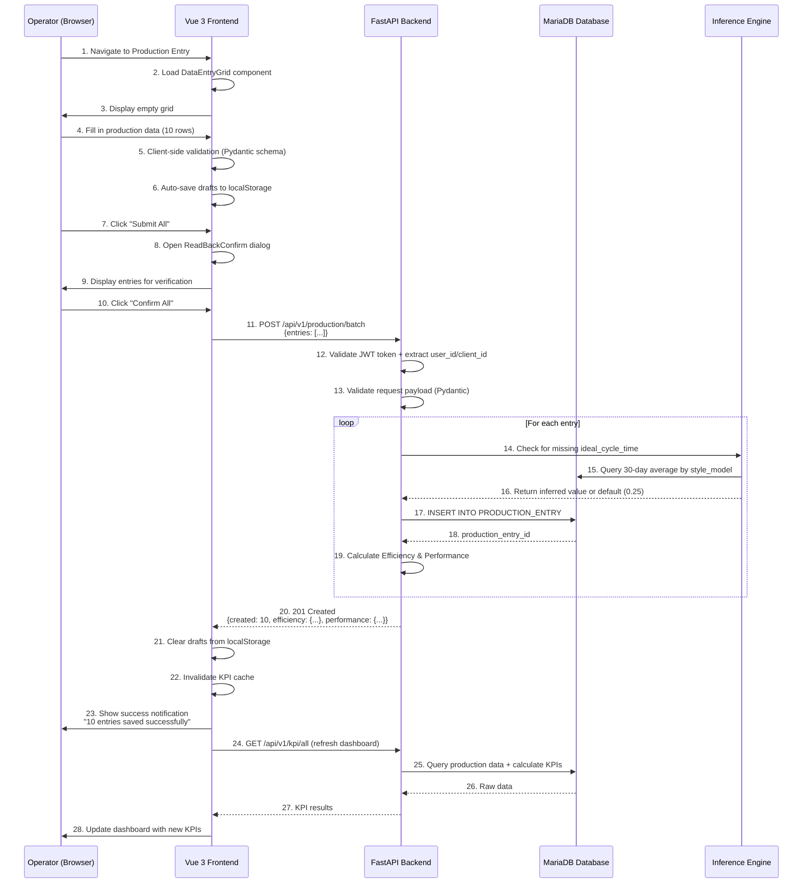
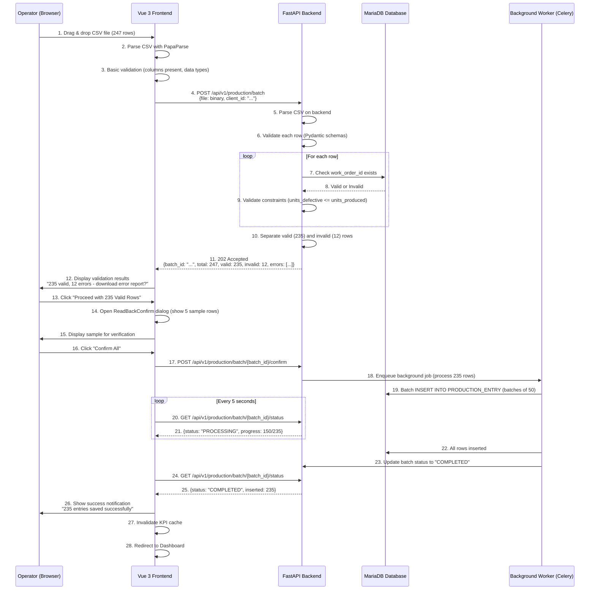
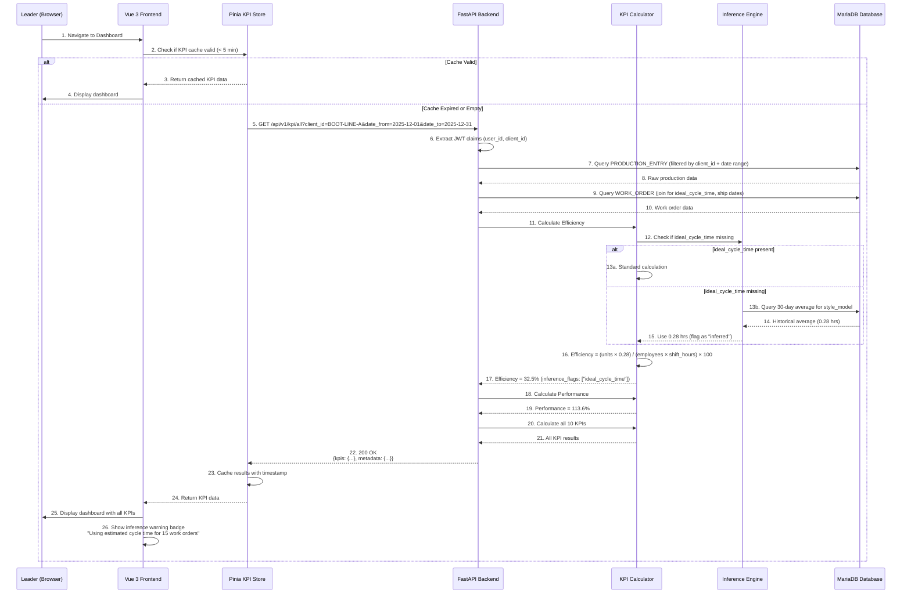
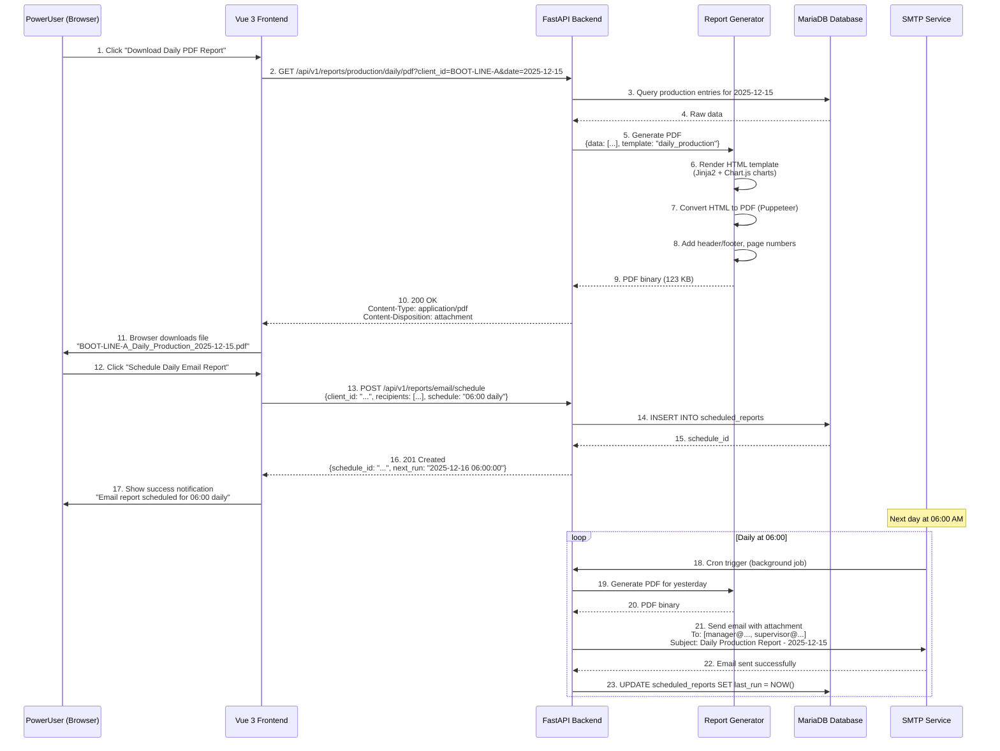

# Manufacturing KPI Platform - Data Flow & Integration Architecture

**Version:** 1.0
**Date:** 2025-12-31
**Author:** System Architect
**Status:** Phase 1 MVP Ready

---

## Table of Contents

1. [System Overview](#system-overview)
2. [Data Flow Diagrams](#data-flow-diagrams)
3. [Integration Patterns](#integration-patterns)
4. [Error Handling & Validation](#error-handling--validation)
5. [Inference Engine Flow](#inference-engine-flow)
6. [Report Generation Pipeline](#report-generation-pipeline)
7. [Real-Time Updates](#real-time-updates)
8. [Security & Access Control](#security--access-control)

---

## System Overview

### High-Level Architecture

```
┌─────────────────────────────────────────────────────────────────┐
│                         CLIENT LAYER                            │
│  ┌──────────────┐  ┌──────────────┐  ┌──────────────┐         │
│  │  Vue 3 SPA   │  │ Mobile App   │  │  API Client  │         │
│  │  (Browser)   │  │  (Phase 2)   │  │  (External)  │         │
│  └──────┬───────┘  └──────┬───────┘  └──────┬───────┘         │
│         │                 │                 │                   │
└─────────┼─────────────────┼─────────────────┼───────────────────┘
          │                 │                 │
          └─────────────────┴─────────────────┘
                            │
                    HTTPS / JWT Auth
                            │
┌───────────────────────────┼───────────────────────────────────┐
│                    APPLICATION LAYER                          │
│         ┌─────────────────▼───────────────────┐              │
│         │        FastAPI REST API             │              │
│         │  ┌──────────────────────────────┐   │              │
│         │  │  Auth Middleware (JWT)       │   │              │
│         │  │  Rate Limiting               │   │              │
│         │  │  Request Validation          │   │              │
│         │  └──────────────────────────────┘   │              │
│         │                                      │              │
│         │  ┌──────────────────────────────┐   │              │
│         │  │  Routers (Endpoints)         │   │              │
│         │  │  - /auth                     │   │              │
│         │  │  - /production               │   │              │
│         │  │  - /kpi                      │   │              │
│         │  │  - /reports                  │   │              │
│         │  └──────────────────────────────┘   │              │
│         │                                      │              │
│         │  ┌──────────────────────────────┐   │              │
│         │  │  Business Logic Layer        │   │              │
│         │  │  - CRUD Operations           │   │              │
│         │  │  - KPI Calculations          │   │              │
│         │  │  - Inference Engine          │   │              │
│         │  │  - Validation Rules          │   │              │
│         │  └──────────────────────────────┘   │              │
│         └──────────────────────────────────────┘              │
│                            │                                   │
│         ┌──────────────────┴──────────────────┐               │
│         │                                     │               │
│    ┌────▼────┐                        ┌──────▼──────┐        │
│    │ Report  │                        │  Background │        │
│    │Generator│                        │    Tasks    │        │
│    │ (PDF/XLS)│                        │  (Celery)  │        │
│    └────┬────┘                        └──────┬──────┘        │
│         │                                     │               │
└─────────┼─────────────────────────────────────┼───────────────┘
          │                                     │
┌─────────┼─────────────────────────────────────┼───────────────┐
│                      DATA LAYER                               │
│         │                                     │               │
│    ┌────▼────────────────────────────────────▼────┐          │
│    │         MariaDB 10.6+ Database              │          │
│    │  ┌────────────────────────────────────┐     │          │
│    │  │  Core Tables                       │     │          │
│    │  │  - CLIENT                          │     │          │
│    │  │  - WORK_ORDER                      │     │          │
│    │  │  - EMPLOYEE                        │     │          │
│    │  │  - USER                            │     │          │
│    │  └────────────────────────────────────┘     │          │
│    │                                              │          │
│    │  ┌────────────────────────────────────┐     │          │
│    │  │  Phase 1 Tables                    │     │          │
│    │  │  - PRODUCTION_ENTRY                │     │          │
│    │  └────────────────────────────────────┘     │          │
│    │                                              │          │
│    │  ┌────────────────────────────────────┐     │          │
│    │  │  Phase 2-4 Tables (Future)         │     │          │
│    │  │  - DOWNTIME_ENTRY                  │     │          │
│    │  │  - ATTENDANCE_ENTRY                │     │          │
│    │  │  - QUALITY_ENTRY                   │     │          │
│    │  └────────────────────────────────────┘     │          │
│    └──────────────────────────────────────────────┘          │
└───────────────────────────────────────────────────────────────┘

┌───────────────────────────────────────────────────────────────┐
│                    EXTERNAL SERVICES                          │
│  ┌──────────────┐  ┌──────────────┐  ┌──────────────┐       │
│  │ Email (SMTP) │  │ File Storage │  │  Monitoring  │       │
│  │  (SendGrid)  │  │   (S3/Local) │  │ (Prometheus) │       │
│  └──────────────┘  └──────────────┘  └──────────────┘       │
└───────────────────────────────────────────────────────────────┘
```

---

## Data Flow Diagrams

### 1. Production Entry Flow (Manual Entry)



---

### 2. CSV Batch Upload Flow



---

### 3. KPI Calculation Flow



---

### 4. Report Generation Flow



---

## Integration Patterns

### Client Isolation Pattern

**Every API request automatically filters by `client_id` from JWT token:**

```python
# FastAPI Dependency Injection
from fastapi import Depends, HTTPException, status
from jose import JWTError, jwt

def get_current_user(token: str = Depends(oauth2_scheme)) -> User:
    try:
        payload = jwt.decode(token, SECRET_KEY, algorithms=[ALGORITHM])
        user_id: str = payload.get("sub")
        client_id: str = payload.get("client_id")

        if user_id is None or client_id is None:
            raise HTTPException(status_code=401, detail="Invalid token")

        return User(user_id=user_id, client_id=client_id, role=payload.get("role"))
    except JWTError:
        raise HTTPException(status_code=401, detail="Could not validate credentials")

# Usage in endpoint
@router.get("/production/entries")
async def list_production_entries(
    current_user: User = Depends(get_current_user),
    date_from: date = Query(...),
    date_to: date = Query(...)
):
    # Automatically filters by current_user.client_id
    entries = await production_crud.get_entries(
        client_id=current_user.client_id,
        date_from=date_from,
        date_to=date_to
    )
    return entries
```

**Database queries ALWAYS include `client_id_fk` filter:**

```sql
-- Good: Client isolation enforced
SELECT * FROM PRODUCTION_ENTRY
WHERE client_id_fk = 'BOOT-LINE-A'
  AND shift_date BETWEEN '2025-12-01' AND '2025-12-31';

-- Bad: Missing client filter (returns all clients' data - SECURITY RISK!)
SELECT * FROM PRODUCTION_ENTRY
WHERE shift_date BETWEEN '2025-12-01' AND '2025-12-31';
```

---

### Validation Pipeline

**3-Layer Validation Strategy:**

```
┌─────────────────────────────────────────────────────────────┐
│                   1. CLIENT-SIDE VALIDATION                 │
│  ┌────────────────────────────────────────────────────┐    │
│  │  Vue Component (Immediate Feedback)                │    │
│  │  - Required field checks                           │    │
│  │  - Data type validation (number, date)             │    │
│  │  - Range validation (units_defective <= units)     │    │
│  │  - Vuetify v-text-field error-messages            │    │
│  └────────────────────────────────────────────────────┘    │
└─────────────────────────────────────────────────────────────┘
                            │
                            ▼
┌─────────────────────────────────────────────────────────────┐
│                   2. API VALIDATION (FastAPI)               │
│  ┌────────────────────────────────────────────────────┐    │
│  │  Pydantic Schema Validation                        │    │
│  │  - Field types (str, int, float, date)             │    │
│  │  - Constraints (min/max, regex patterns)           │    │
│  │  - Custom validators (@validator)                  │    │
│  │  - Returns 422 with detailed error messages        │    │
│  └────────────────────────────────────────────────────┘    │
└─────────────────────────────────────────────────────────────┘
                            │
                            ▼
┌─────────────────────────────────────────────────────────────┐
│                3. DATABASE VALIDATION (MariaDB)             │
│  ┌────────────────────────────────────────────────────┐    │
│  │  Database Constraints                              │    │
│  │  - Foreign key integrity (work_order_id exists)    │    │
│  │  - CHECK constraints (units > 0)                   │    │
│  │  - UNIQUE constraints (prevent duplicates)         │    │
│  │  - NOT NULL enforcement                            │    │
│  └────────────────────────────────────────────────────┘    │
└─────────────────────────────────────────────────────────────┘
```

---

## Inference Engine Flow

### Missing Data Handling Strategy

```python
# app/calculations/inference.py

from typing import Optional
from datetime import date, timedelta
from sqlalchemy.orm import Session
from sqlalchemy import func

class InferenceEngine:
    def __init__(self, db: Session):
        self.db = db

    def infer_ideal_cycle_time(
        self,
        work_order_id: str,
        style_model: str,
        client_id: str
    ) -> tuple[float, str, float]:
        """
        Infer ideal_cycle_time using priority fallback strategy.

        Returns:
            (value, source, confidence_score)

        Priority:
        1. Client/Style standard configuration
        2. 30-day historical average for same style_model
        3. Industry default (0.25 hours)
        """

        # Priority 1: Client/Style configuration
        config = self.db.query(ClientConfig).filter(
            ClientConfig.client_id == client_id,
            ClientConfig.style_model == style_model
        ).first()

        if config and config.ideal_cycle_time:
            return (config.ideal_cycle_time, "client_config", 1.0)

        # Priority 2: 30-day historical average
        cutoff_date = date.today() - timedelta(days=30)

        avg_result = self.db.query(
            func.avg(WorkOrder.ideal_cycle_time)
        ).join(ProductionEntry).filter(
            WorkOrder.client_id == client_id,
            WorkOrder.style_model == style_model,
            WorkOrder.ideal_cycle_time.isnot(None),
            ProductionEntry.shift_date >= cutoff_date
        ).scalar()

        if avg_result:
            return (float(avg_result), "30_day_average", 0.85)

        # Priority 3: Industry default
        return (0.25, "industry_default", 0.5)

    def infer_planned_ship_date(
        self,
        planned_start_date: Optional[date],
        ideal_cycle_time: float,
        planned_quantity: int
    ) -> tuple[date, str]:
        """
        Infer planned_ship_date from other fields.

        Returns:
            (ship_date, source)
        """

        if planned_start_date and ideal_cycle_time:
            # Calculate total production days
            total_hours = planned_quantity * ideal_cycle_time
            production_days = total_hours / 9  # Assuming 9-hour shifts

            ship_date = planned_start_date + timedelta(days=int(production_days) + 1)
            return (ship_date, "calculated_from_cycle_time")

        # Fallback: 7 days from today
        return (date.today() + timedelta(days=7), "default_7_days")
```

**Inference Applied in KPI Calculation:**

```python
# app/calculations/efficiency.py

def calculate_efficiency(
    units_produced: int,
    ideal_cycle_time: Optional[float],
    employees_assigned: int,
    shift_hours: float,
    work_order_id: str,
    style_model: str,
    client_id: str,
    db: Session
) -> dict:
    """Calculate Production Efficiency with inference support."""

    inference_flags = []
    inference_engine = InferenceEngine(db)

    # Infer ideal_cycle_time if missing
    if ideal_cycle_time is None:
        ideal_cycle_time, source, confidence = inference_engine.infer_ideal_cycle_time(
            work_order_id, style_model, client_id
        )
        inference_flags.append({
            "field": "ideal_cycle_time",
            "source": source,
            "confidence": confidence,
            "value_used": ideal_cycle_time
        })

    # Calculate efficiency
    hours_produced = units_produced * ideal_cycle_time
    hours_available = employees_assigned * shift_hours
    efficiency = (hours_produced / hours_available) * 100 if hours_available > 0 else 0

    return {
        "efficiency": round(efficiency, 2),
        "hours_produced": round(hours_produced, 2),
        "hours_available": round(hours_available, 2),
        "inference_applied": len(inference_flags) > 0,
        "inference_flags": inference_flags,
        "confidence_score": min([f["confidence"] for f in inference_flags]) if inference_flags else 1.0
    }
```

---

## Error Handling & Validation

### Error Response Format

**All errors follow this standard structure:**

```json
{
  "error": {
    "code": "VALIDATION_ERROR",
    "message": "units_defective cannot exceed units_produced",
    "details": [
      {
        "loc": ["body", "units_defective"],
        "msg": "must be <= units_produced (100)",
        "type": "value_error.constraint",
        "ctx": {
          "limit_value": 100,
          "actual_value": 150
        }
      }
    ],
    "timestamp": "2025-12-31T10:00:00Z",
    "request_id": "req-abc123",
    "path": "/api/v1/production/entry"
  }
}
```

### Frontend Error Handling

```typescript
// services/api.ts (Axios interceptor)

import axios from 'axios';
import { useAuthStore } from '@/stores/auth';
import { useNotificationStore } from '@/stores/notification';

const api = axios.create({
  baseURL: import.meta.env.VITE_API_BASE_URL,
  timeout: 30000,
});

// Request interceptor (add JWT token)
api.interceptors.request.use(
  (config) => {
    const authStore = useAuthStore();
    if (authStore.token) {
      config.headers.Authorization = `Bearer ${authStore.token}`;
    }
    return config;
  },
  (error) => Promise.reject(error)
);

// Response interceptor (handle errors globally)
api.interceptors.response.use(
  (response) => response,
  async (error) => {
    const notificationStore = useNotificationStore();

    if (error.response) {
      const { status, data } = error.response;

      switch (status) {
        case 400:
          notificationStore.showError(
            data.error?.message || 'Invalid request data'
          );
          break;

        case 401:
          // Token expired - try refresh
          const authStore = useAuthStore();
          try {
            await authStore.refreshToken();
            // Retry original request
            return api.request(error.config);
          } catch {
            authStore.logout();
            router.push('/login');
          }
          break;

        case 403:
          notificationStore.showError('You do not have permission for this action');
          break;

        case 404:
          notificationStore.showError('Resource not found');
          break;

        case 422:
          // Validation errors - display field-level errors
          const validationErrors = data.error?.details || [];
          notificationStore.showValidationErrors(validationErrors);
          break;

        case 500:
          notificationStore.showError('Server error. Please try again later.');
          break;

        default:
          notificationStore.showError('An unexpected error occurred');
      }
    } else if (error.request) {
      // Network error
      notificationStore.showError('Network error. Please check your connection.');
    }

    return Promise.reject(error);
  }
);

export default api;
```

---

## Real-Time Updates

### KPI Auto-Refresh Strategy

```typescript
// composables/useKpiAutoRefresh.ts

import { ref, onMounted, onUnmounted } from 'vue';
import { useKpiStore } from '@/stores/kpi';
import type { KpiFilter } from '@/types/kpi';

export function useKpiAutoRefresh(filter: KpiFilter, intervalSeconds = 30) {
  const kpiStore = useKpiStore();
  const isRefreshing = ref(false);
  let intervalId: number;

  async function refresh() {
    if (isRefreshing.value) return;

    isRefreshing.value = true;
    try {
      await kpiStore.fetchAllKpis(filter);
    } finally {
      isRefreshing.value = false;
    }
  }

  onMounted(() => {
    // Initial fetch
    refresh();

    // Auto-refresh every 30 seconds
    intervalId = window.setInterval(refresh, intervalSeconds * 1000);
  });

  onUnmounted(() => {
    clearInterval(intervalId);
  });

  return { isRefreshing, refresh };
}
```

**Usage in Dashboard:**

```vue
<script setup lang="ts">
import { useKpiAutoRefresh } from '@/composables/useKpiAutoRefresh';
import { useAuthStore } from '@/stores/auth';

const authStore = useAuthStore();

const filter = {
  client_id: authStore.currentUser?.client_id,
  date_from: '2025-12-01',
  date_to: '2025-12-31',
  aggregation: 'daily'
};

const { isRefreshing, refresh } = useKpiAutoRefresh(filter, 30);
</script>

<template>
  <v-card>
    <v-card-title>
      KPI Dashboard
      <v-chip v-if="isRefreshing" color="info" class="ml-2">
        Refreshing...
      </v-chip>
    </v-card-title>
    <!-- Dashboard content -->
  </v-card>
</template>
```

---

## Security & Access Control

### Data Access Matrix

| Role | Production Entry | KPI View | Reports | Admin |
|------|-----------------|----------|---------|-------|
| **OPERATOR_DATAENTRY** | Create (own client) | View (own client) | ❌ | ❌ |
| **LEADER_DATACONFIG** | Create/Edit (own client) | View (own client) | View (own client) | ❌ |
| **POWERUSER** | Create/Edit (multi-client) | View (multi-client) | View/Export (multi-client) | ❌ |
| **ADMIN** | All operations | All clients | All operations | User management |

### Audit Trail

**Every data modification is logged:**

```python
# Automatic audit fields in SQLAlchemy model
class ProductionEntry(Base):
    __tablename__ = "PRODUCTION_ENTRY"

    production_entry_id = Column(String(50), primary_key=True)
    # ... other fields ...

    created_by = Column(String(20), ForeignKey("USER.user_id"), nullable=False)
    created_at = Column(TIMESTAMP, server_default=func.now())
    updated_at = Column(TIMESTAMP, server_default=func.now(), onupdate=func.now())

    # Relationships for audit trail
    creator = relationship("User", foreign_keys=[created_by])
```

**Audit log query:**

```sql
-- Who edited production entries in the last 24 hours?
SELECT
    pe.production_entry_id,
    pe.work_order_id_fk,
    u.full_name AS edited_by,
    pe.updated_at,
    TIMESTAMPDIFF(SECOND, pe.created_at, pe.updated_at) AS seconds_after_creation
FROM PRODUCTION_ENTRY pe
JOIN USER u ON pe.created_by = u.user_id
WHERE pe.updated_at > DATE_SUB(NOW(), INTERVAL 24 HOUR)
  AND pe.created_at < pe.updated_at
ORDER BY pe.updated_at DESC;
```

---

## Performance Optimization

### Database Query Optimization

**Use indexes for common queries:**

```sql
-- 3-month KPI query (most common)
EXPLAIN SELECT
    client_id_fk,
    shift_date,
    SUM(units_produced) AS total_units,
    SUM(units_defective) AS total_defects,
    SUM(run_time_hours) AS total_runtime
FROM PRODUCTION_ENTRY
WHERE client_id_fk = 'BOOT-LINE-A'
  AND shift_date BETWEEN '2025-10-01' AND '2025-12-31'
GROUP BY client_id_fk, shift_date;

-- Index ensures < 100ms query time
-- Uses: idx_production_client_date (client_id_fk, shift_date)
```

### API Response Caching

```python
# app/routers/kpi.py

from functools import lru_cache
from datetime import datetime, timedelta

@router.get("/kpi/efficiency")
@lru_cache(maxsize=128)  # Cache last 128 unique requests
async def get_efficiency(
    client_id: str,
    date_from: date,
    date_to: date,
    current_user: User = Depends(get_current_user)
):
    # Cache expires after 5 minutes (implemented in Store)
    ...
```

---

**End of Data Flow & Integration Architecture**
